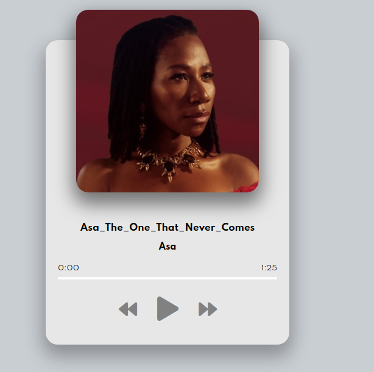

# music-player

This page is a basic music player design, this project has been an exercise of using javascript to manipulate the dom and events handling. the main purpose of this project has been to build a user interactive page to aquire further practice on using javascript to manipulate the dom.

## Built With

- HTML5
- CSS3
-JAVASCRIPT

## Live Demo

Live link here: https://rawcdn.githack.com/ignatius22/Responsive_Design/7ffbf9416436234415625d532273a23c230d311e/index.html

## Authors

👤 **Author1**
Ignatius Sani:
- Github: https://github.com/ignatius22 
- Linkedin: https://www.linkedin.com/in/ignatiussani  
